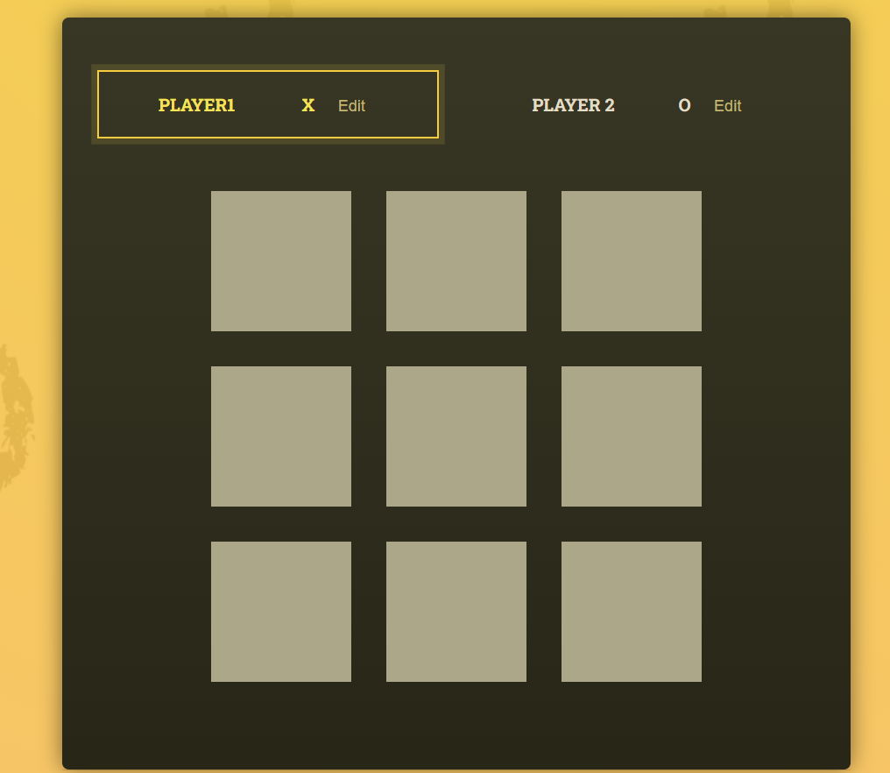
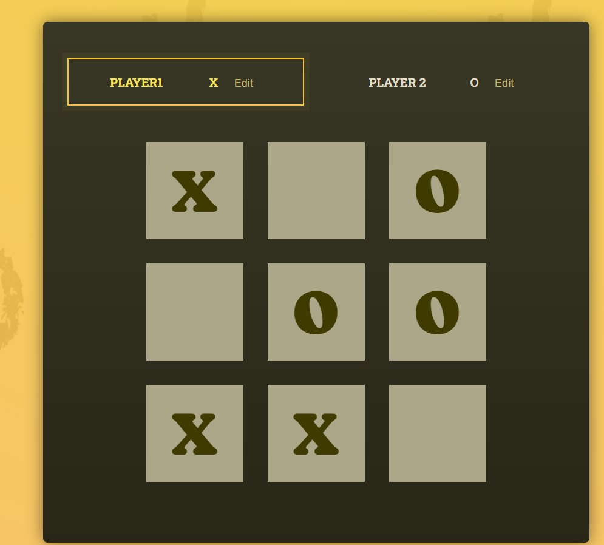
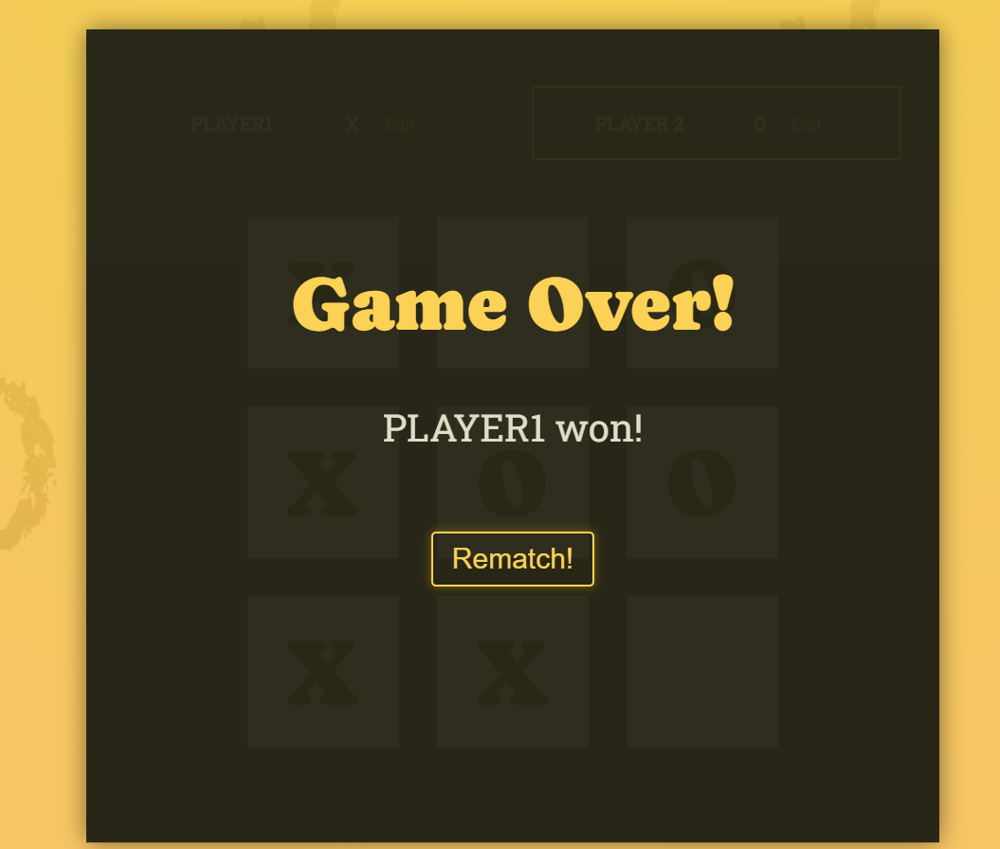

# 빙고 게임판 프로젝트 (학습용 프로젝트)

- 리액트를 활용한 빙고 게임판을 만들어 보았다.
- 플레이어 2명이 차례로 빙고판 영역 중 하나를 선택하며, 빙고가 생기면 끝나는 게임
- 조건부 렌더링을 통한 스타일 적용과 빙고 게임 논리 로직을 js 파일로 따로 작성하며, 개발 숙련도를 높일 수 있었다.

### 첫 화면

;

### 게임 진행 화면

;

### 종료 화면

;
